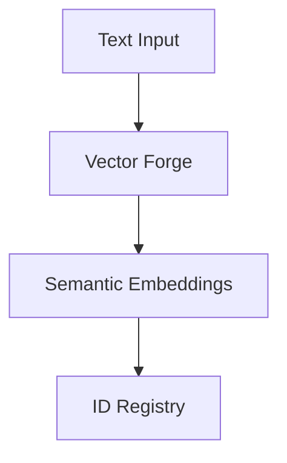
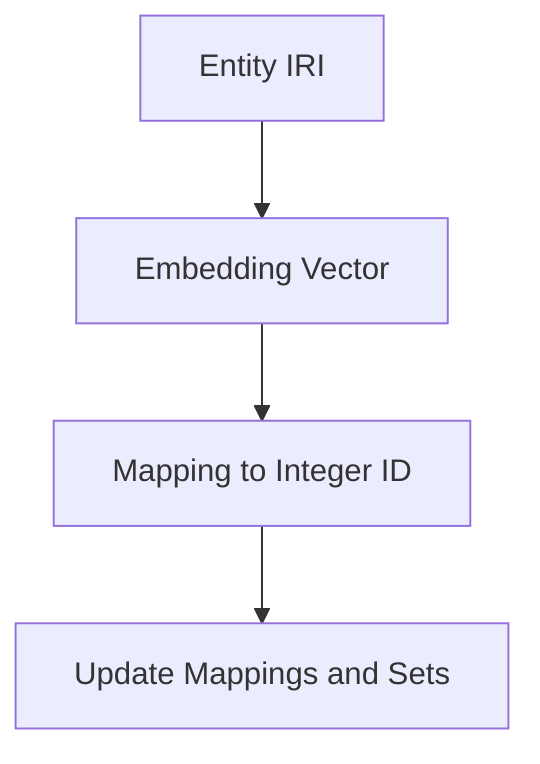
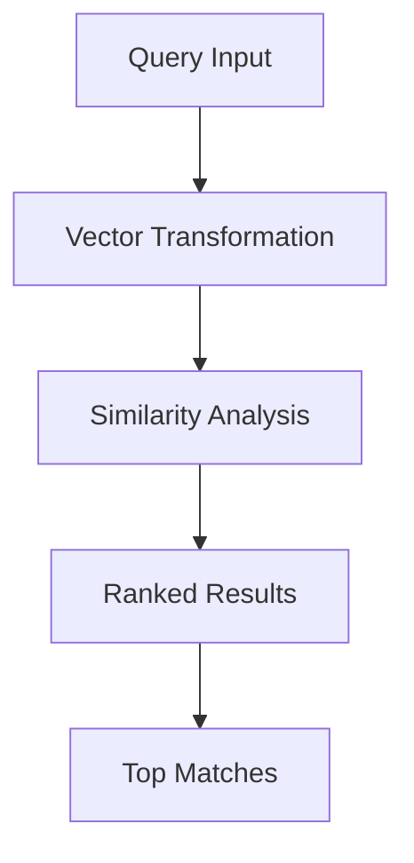
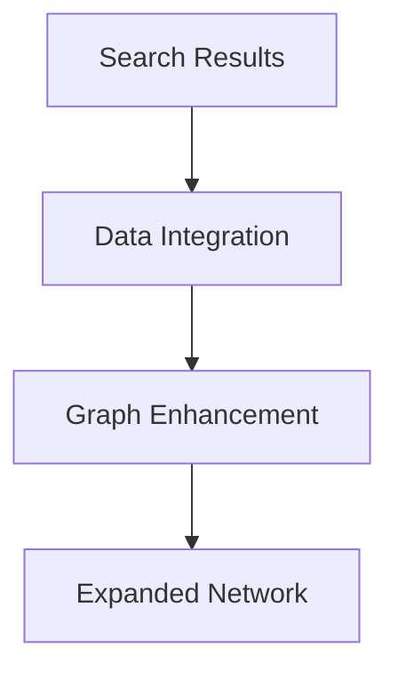
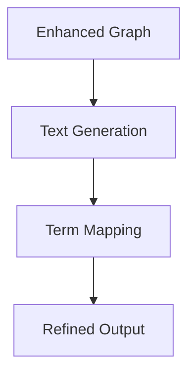
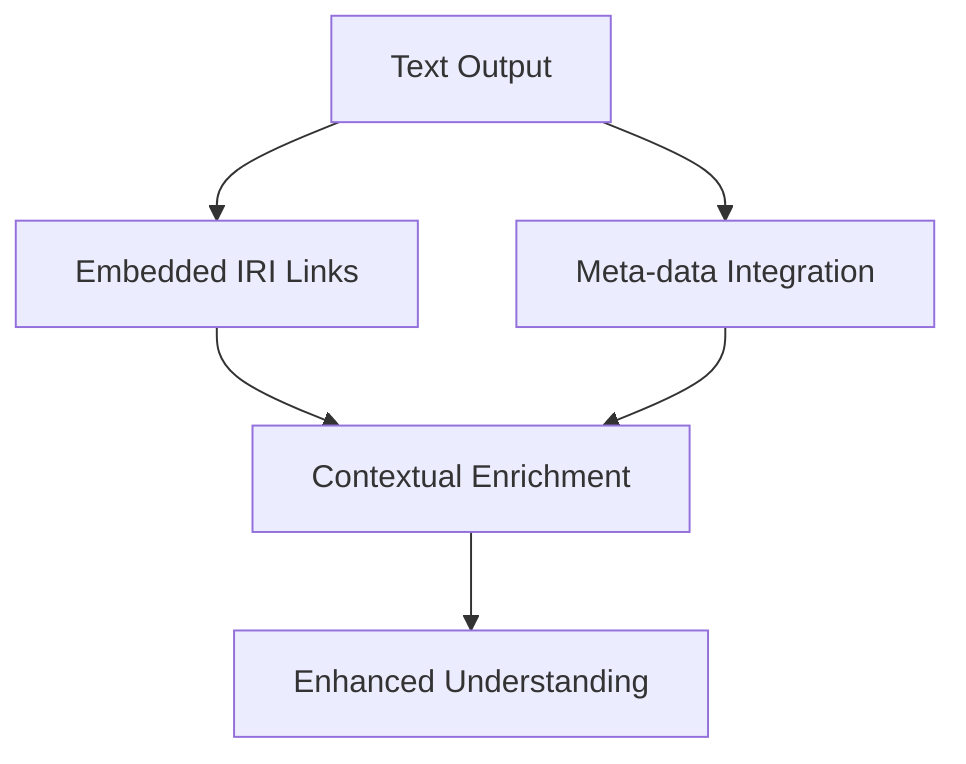

# **Semantic Augmentation for Large Language Models: A Technical Paper**

## **Abstract**

This paper presents **semantic neural augmentation**—an innovative approach designed to significantly enhance AI cognition through the dynamic integration of contextually relevant canonical facts. Our methodology involves the development and enrichment of canonical concept graphs utilizing Internationalized Resource Identifiers (IRIs), synthesizing both semantic (e.g., RDF triples, quads) and textual data (e.g., prose, scholarly articles, codebases).

Our framework caters to a diverse range of applications, including anomaly detection, source code retrieval, information extraction, finite state goal planning, trust assertion, provenance analysis, and fraud detection. By incorporating IRIs into generated text—either as interactive hyperlinks or embedded meta-data—our approach enhances backtracking, provenance tracking, and contextual enrichment. This leads to a deeper and more transparent understanding of AI-generated content, improving LLM functionalities and providing a richer, traceable context for nuanced AI interactions.

## **1. Introduction**

Large Language Models (LLMs) have made remarkable advancements in natural language processing, achieving sophisticated language understanding and generation. Despite these advancements, their effectiveness is often constrained by static knowledge bases and a lack of dynamically integrated, contextually relevant information. To address these limitations, we propose **semantic neural augmentation**, a novel method that enriches LLMs by dynamically incorporating contextually rich canonical data through IRIs.

### **The Quest for Truth and Curiosity**

Our approach is designed to empower AI with:
- **Enhanced Truth-Seeking Abilities:** By linking generated text to verified canonical sources, our system enables the AI to trace the origins of information, thereby enhancing accuracy and reliability. This facilitates more rigorous validation and transparency in AI-generated content.

- **Curiosity-Driven Exploration:** By enriching text with semantic data, the AI is encouraged to explore and comprehend complex relationships between concepts. This fosters a deeper, curiosity-driven learning process, enabling the AI to engage in more nuanced and insightful exploration of information.

### **Semantic Neural Augmentation: What’s New?**

Our approach revolutionizes AI cognition with several key innovations that transform the way semantic information is processed and utilized:

- **Semantic Overdrive:** We place semantics—structured as subject-predicate-object triples and vector spaces—at the core of our approach. By viewing knowledge as an interconnected web, we emphasize the importance of relational context in understanding and generating accurate information.

- **Nearest Neighbour Clusters:** Concepts are grouped into clusters based on their nearest neighbours. This method facilitates pattern recognition and deepens conceptual understanding by organizing related ideas in a way that mirrors natural cognitive processes.

- **Conceptual Indexing:** Our indexing system provides an intuitive map through the knowledge network. This approach simplifies navigation, allowing for more efficient retrieval and connection of related concepts, thereby enhancing the AI’s ability to make sense of complex information.

- **Latent Space Discretization:** We break down abstract concepts into distinct, quantifiable units within the latent space. This discretization integrates abstract ideas with concrete facts, creating a cohesive semantic framework that unifies diverse sources of information.

- **Multi-Modal Fusion:** By synthesizing vector embeddings, RDF triples, and latent space representations, we develop a multi-dimensional model. This fusion enhances the AI’s capability to generate responses that are not only nuanced but also contextually rich, reflecting a deeper understanding of the input.

- **Conceptual Quantization:** This innovative technique involves defining and breaking down complex or abstract concepts into smaller, manageable units. By segmenting these concepts into discrete quanta, we improve the AI's ability to analyze and interpret nuanced information. Each quantum represents a specific semantic facet, which is then integrated with relevant semantic data to enrich the overall understanding of the concept.

### **How It All Fits Together**

**Semantic Overdrive** ensures that we are not just processing isolated pieces of information but rather integrating them into a coherent, interconnected web of knowledge.

**Nearest Neighbour Clusters** and **Conceptual Indexing** work together to organize and navigate cognitive task efficiently, making it easier for the AI to identify and understand relationships between concepts.

**Latent Space Discretization** and **Conceptual Quantization** refine how abstract ideas are represented and integrated, enabling the AI to handle complex concepts with greater clarity and precision.

**Multi-Modal Fusion** ties everything together by creating a rich, multi-dimensional model that enhances the AI’s ability to generate contextually relevant and insightful responses. This comprehensive approach ensures that AI interactions are both deeply informed and highly accurate, paving the way for more advanced and meaningful applications.
## **2. Algorithm Overview**

### **2.1 Embedding and Indexing**

#### **2.1.1 Embedding Content**

We convert textual content into high-dimensional vectors using an embedding model. These vectors capture the essence of the content and are linked to unique integer IDs.

#### **2.1.2 Indexing Entities**

Entities are indexed by mapping their embedding vectors to unique integer IDs, ensuring accurate data structure updates.

### **2.2 Conceptual Graph Construction**

#### **2.2.1 Nominal Canonical Conceptual Graphs**

Indexed embeddings are organized into graphs where nodes represent concepts or entities and edges denote semantic relationships, facilitating efficient retrieval and context-aware integration.

### **2.3 Searching and Hydration**

#### **2.3.1 Searching for Relevant Entities**

We search for entities by embedding text queries, computing cosine similarities with indexed vectors, and ranking the results.

#### **2.3.2 Hydrating Nominal Canonical Conceptual Graphs**

The system retrieves and integrates related data based on search results, enhancing the conceptual graphs.

### **2.4 Contextually Enriched and Semantically Dense Text Generation**

#### **2.4.1 Graph-to-Text Conversion**

We convert enriched conceptual graphs into semantically dense text, which is indexed to refine understanding.

### **2.5 Linking IRIs in Generated Text**

Integrating IRIs into generated text—either as hyperlinks or embedded meta-data—enables:
- **Backtracking:** Allows users to trace the origin of information and understand the context of specific data points.
- **Provenance Tracking:** Provides transparent histories of data origins and modifications.
- **Contextual Enrichment:** Enhances the richness of generated text by linking to detailed, related canonical facts.

## **3. Implementation Details**

### **3.1 Data Structures**

- **Vectors by ID:** Maps integer IDs to high-dimensional vectors.
- **Thing by ID:** Maps integer IDs to IRIs.
- **ID by Thing:** Maps IRIs to integer IDs.
- **Index by Thing:** Maps concepts to integer ID sets.
- **Content Hash by Thing:** Tracks changes in content.

### **3.2 Embedding Model**

The **AllMiniLmL6V2EmbeddingModel** is employed for its efficiency in generating accurate high-dimensional vectors from textual content.

### **3.3 Cosine Similarity Calculation**

Cosine similarity measures the similarity between vectors:

\[
\text{cosine\_similarity}(A, B) = \frac{A \cdot B}{\|A\| \|B\|}
\]

where \(A\) and \(B\) are vectors, \(A \cdot B\) is their dot product, and \(\|A\|\) and \(\|B\|\) are their magnitudes.

## **4. Use Cases**

### **4.1 Anomaly Detection**

#### **Text-to-Graph**

- **Data Collection:** Build graphs with nodes and edges representing normal and anomalous patterns.
- **Graph Enrichment:** Enhance graphs with contextually relevant data for anomaly detection.

#### **Graph-to-Text**

- **Text Generation:** Create detailed descriptions of anomalies and deviations.
- **Advanced Indexing:** Use indexes to identify and verify anomalies.

#### **Graph-to-Answer**

- **Anomaly Analysis:** Generate comprehensive reports based on graph analysis.

### **4.2 Source Code Lookup**

#### **Text-to-Graph**

- **Data Collection:** Embed and index code snippets and related content.
- **Graph Construction:** Develop graphs with nodes for code elements and their relationships.

#### **Graph-to-Text**

- **Text Generation:** Produce enriched text from code graphs.
- **Advanced Indexing:** Index text for efficient code retrieval.

#### **Graph-to-Answer**

- **Code Retrieval:** Find relevant code snippets based on enriched text.

### **4.3 Information Retrieval**

#### **Text-to-Graph**

- **Data Collection:** Embed textual information into graphs.
- **Graph Enrichment:** Enhance graphs with contextually relevant data.

#### **Graph-to-Text**

- **Text Generation:** Generate detailed, semantically rich text.
- **Advanced Indexing:** Index text to support accurate search results.

#### **Graph-to-Answer**

- **Information Retrieval:** Provide accurate information based on semantic analysis.

### **4.4 Finite State Goal Planning**

#### **Text-to-Graph**

- **State Representation:** Create graphs for states and transitions in goal planning.
- **Graph Enrichment:** Reflect realistic planning scenarios in enriched graphs.

#### **Graph-to-Text**

- **Text Generation:** Develop detailed plans and strategies from state graphs.
- **Advanced Indexing:** Index text for effective planning.

#### **Graph-to-Answer**

- **Plan Generation:** Produce strategies and plans based on enriched analysis.

### **4.5 Trust Assertion**

#### **Text-to-Graph**

- **Data Collection:** Build trust graphs from source information.
- **Graph Construction:** Develop graphs showing sources, claims, and trust relationships.

#### **Graph-to-Text**

- **Text Generation:** Convert trust graphs into descriptions of source reliability.
- **Advanced Indexing:** Index text to verify trust claims.

#### **Graph-to-Answer**

- **Trust Assessment:** Report on the trustworthiness of sources based on graph analysis.

### **4.6 Provenance and Fraud Detection**

#### **Text-to-Graph**

- **Data Collection:** Build provenance graphs from data histories.
- **Graph Construction:** Represent data origins and modifications in graphs.

#### **Graph-to-Text**

- **Text Generation:** Generate tracking reports from provenance graphs.
- **Advanced Indexing:** Refine tracking and fraud detection with indexed text.

#### **Graph-to-Answer**

- **Provenance Tracking:** Trace data origins and modifications.
- **Fraud Detection:** Analyze graphs for fraudulent activities and generate reports.

## **5. Conclusion**

This paper presents a novel approach to semantic neural augmentation, enhancing LLM capabilities by integrating contextually relevant knowledge through IRIs. By linking IRIs into generated text, we provide robust backtracking, provenance tracking, and contextual enrichment. This advancement improves LLM performance in anomaly detection, source code lookup, information retrieval, goal planning, trust assertion, provenance tracking, and fraud detection, paving the way for more sophisticated AI interactions.

## **References**

1. Devlin, J., Chang, M. W., Lee, K., & Toutanova, K. (2018). **BERT: Pre-training of Deep Bidirectional Transformers for Language Understanding**. arXiv preprint arXiv:1810.04805.
2. Vaswani, A., Shazeer, N., Parmar, N., Uszkoreit, J., Jones, L., Kaiser, Ł., & Polosukhin, I. (2017). **Attention is All You Need**. In Advances in Neural Information Processing Systems (NeurIPS).
3. Liu, Y., Ott, M., Goyal, N., Du, J., Joshi, M., Chen, D., & Wang, M. (2019). **RoBERTa: A Robustly Optimized BERT Pretraining Approach**. arXiv preprint arXiv:1907.11692.
4. Tunstall, L. M., & Sanders, L. S. (2020). **Knowledge Graphs: The Next Frontier for Data Integration and AI**. IEEE Transactions on Knowledge and Data Engineering.
