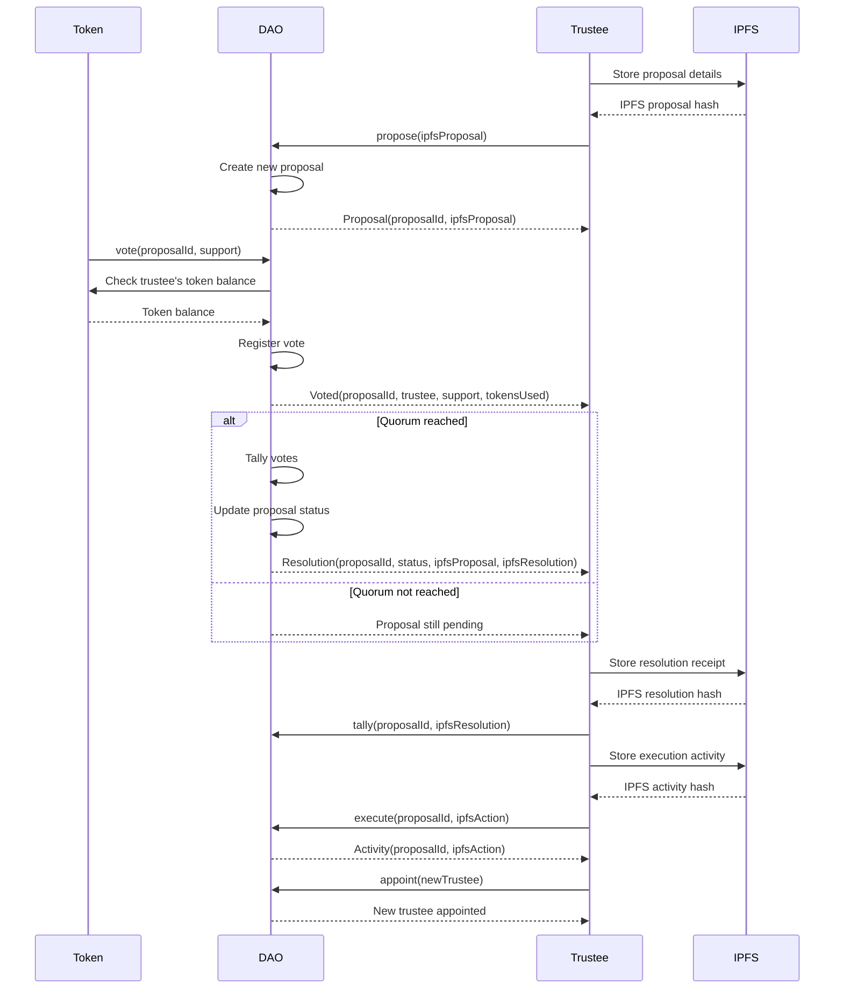

The heart of a DAO is a smart contract - a digital rulebook, if you like.

The governance of a DAO is observed as events on the blockchain.

This ensures the auditability, explain-ability and transparency of its governance.

Its knowledge can be encrypted by the trustee or observable, as required.

It curates its own unique knowledge from trustees, observations, logic and inference.

1. **Proposals:** Trustees publish proposals as linked data on IPFS then notifies the DAO.

2. **Voting:** Token holders vote on proposals, with the DAO verifying and recording votes.

3. **Resolution:** If quorum is reached, the DAO tallies votes, updates proposal status and notifies stakeholders.

4. **Observations:** The Trustees can share facts, insights and observations with the DAO on IPFS .

## Governance flow

Here we see the interaction between the Token Holders, the DAO smart contract, the Trustee, and the Interplanetary Filesystem (IPFS):

