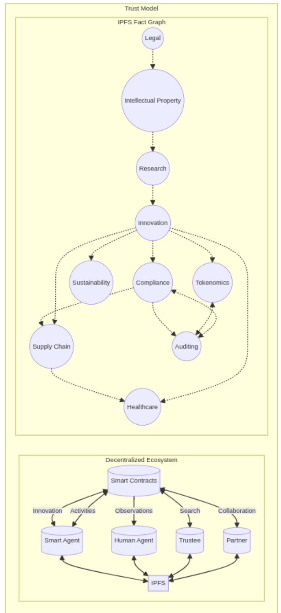

# Trusting AI: Global Challenges and Emerging Opportunities

## Abstract

Traditional centralized trust models face significant challenges in ensuring transparency, reliability, and security. 

We need trustworthy information, innovation and collaboration to address global challenges. 

This white paper focuses on the use cases, identifies the limitations of existing trust models, and proposes innovative solutions to tackle pressing global problems through decentralized fact claims. 

In this white paper, we present a short, pragmatic upgrade path, for factual assertions in the AI era, that we call `fact graphs`. 

---

## 1. Introduction

Traditional trust models rely on centralized authorities to validate and authenticate information, leading to issues of data manipulation, censorship, and single points of failure. 

In contrast, decentralized ecosystems offer a distributed approach to trust, where consensus mechanisms and cryptographic techniques ensure transparency and immutability. 

By leveraging technologies like Linked Data, IPFS and Smart Contracts, decentralized systems can revolutionize how we collaborate and address global challenges.

---

## 2. Problems with Existing Trust Models

- **Centralization**: Traditional trust models rely on centralized authorities to validate and authenticate information, leading to single points of failure and vulnerabilities to manipulation and censorship.

- **Lack of Transparency**: Centralized systems often lack transparency, making it difficult for stakeholders to verify the integrity and authenticity of data.

- **Data Silos**: Data silos hinder collaboration and innovation by restricting access to valuable information and insights.

- **Security Vulnerabilities**: Centralized systems are prone to security vulnerabilities, such as data breaches, hacking, and insider threats.

---

## 3. Solutions to Global Problems

- **Decentralization**: Decentralized ecosystems distribute trust among network participants, reducing reliance on centralized authorities and mitigating single points of failure.

- **Transparency**: Decentralized fact claims provide transparent and immutable records of transactions and activities, enabling stakeholders to verify the integrity and authenticity of data.

- **Interoperability**: Linked Data standards ensure interoperability across heterogeneous systems, enabling seamless integration and sharing of information.

- **Security**: Cryptographic techniques and consensus mechanisms ensure the security and integrity of data in decentralized ecosystems, protecting against unauthorized access and tampering.

## 4. Technical Architecture

The technical architecture of a fact claims consists of several key components:

- **IPFS Network:** A peer-to-peer network of nodes that store and retrieve immutable files using content-based addressing.
- **Fact Graph:** A graph data structure representing interconnected fact graphs and claims within the decentralized system.
- **Trust Chains:** Blockchain smart contracts manage governance of an immutable custody chain of fact graphs.
- **Smart Agents:** Responsible for RDF(S) sub-graphs such as interfacing with the IPFS network and Internet for storage, retrieval, curation, inference, visualization and publication of fact graphs.

---
## 5. Use Cases

### Regulatory Compliance

Existing regulatory compliance processes often suffer from inefficiencies, lack of transparency, and data silos.

Decentralized fact claims can streamline compliance efforts by providing transparent and immutable records of regulatory activities.

Fact claims can automate compliance procedures, reducing administrative overhead and ensuring adherence to regulatory standards across industries.

### Land Registries

Land title registries face challenges such as fraudulent transactions, disputes over ownership, and inefficient record-keeping systems.

Decentralized fact claims can address these issues by providing transparent and immutable records of land ownership and transactions.

Fact claims can automate the transfer of land titles, ensuring accuracy and reducing the risk of fraud.

Additionally, decentralized systems enable real-time updates to land title registries, improving efficiency and accessibility for stakeholders.

### Real Estate

Maintaining accurate and up-to-date records of home-ownership is essential for property owners, government agencies, and financial institutions.

Decentralized fact claims offer a reliable solution for recording property deeds, mortgage agreements, and property tax records.

By leveraging decentralized systems, stakeholders can access authenticated and tamper-resistant records, facilitating property transactions, and ensuring the integrity of property records.

Fact claims help to digitally trust real estate contracts, including property transfers, payments, and escrow arrangements.

This reduces the need for intermediaries and minimizes the risk of disputes or errors in the transaction process.

### Supply Chain Management

Supply chains are plagued by issues such as counterfeit products, opaque transactions, and unethical practices.

Decentralized fact claims enable end-to-end visibility and traceability in supply chains, empowering consumers to make informed choices.

By recording every transaction on a tamper-resistant ledger, fact claims ensure integrity and accountability throughout the supply chain.

### Healthcare Data Management

The healthcare industry faces challenges in interoperability, data security, and patient privacy.

Decentralized fact claims can revolutionize healthcare data management by providing a secure and interoperable platform for storing and sharing medical records.

Patients retain control over their data through encrypted access controls, while healthcare providers benefit from real-time access to accurate and up-to-date information.

### Intellectual Property Management

Intellectual property rights are often subject to disputes, infringement, and piracy.

Decentralized fact claims offer a solution by providing transparent and timestamped records of intellectual property ownership and usage rights.

Fact claims can automate licensing agreements and royalty payments, ensuring fair compensation for creators and rights holders.

---
## 6. References

Berners-Lee, T(1999). World Wide Web Consortium. HTML.https://www.w3.org/MarkUp/

Fielding, R.(1999). World Wide Web Consortium. HTTP.https://www.w3.org/Protocols/

Benet, J.(2014). IPFS - Content Addressed, Versioned, P2P File System. https://ipfs.io/

Brickley, D., & Guha, R. V.(2004). RDF Vocabulary Description Language 1.0: RDF Schema. https://www.w3.org/RDF/

## 7. Conclusion

Decentralized fact claims offer a transformative solution to the limitations of existing trust models, enabling transparent, secure, and interoperable collaborations across diverse domains. 

By embracing decentralized technologies, we can address pressing global challenges and create a more transparent, equitable, and sustainable future for all.
